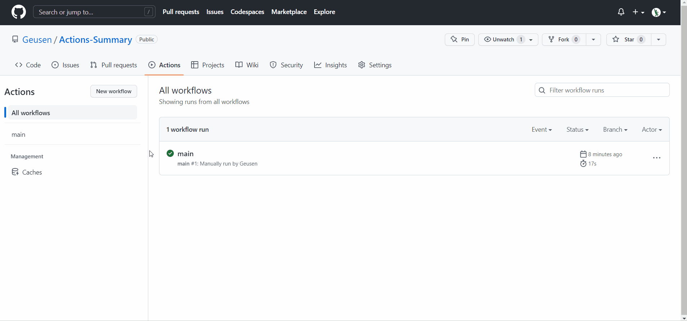

<!--
title:   【GitHub Actions】Job SummaryでGitHub ActionsでのPythonの実行結果を見やすくする
tags:    GitHubActions,Python,備忘録,初心者
id:      dbec1493f690a2290729
private: false
-->
# はじめに

サイコロが急に必要になったので、GitHub ActionsでPythonを動かして1～6の数字をランダムに表示させてみます。(無理矢理過ぎる話題作り)
ymlファイルとpythonのファイルは以下のようになっています。

```yaml:main.yml
name: main
on:
  workflow_dispatch:

jobs:
  build:
    runs-on: ubuntu-latest
    steps:
      - uses: actions/checkout@v3
      - uses: actions/setup-python@v4
        with:
          python-version: '3.x'
          architecture: 'x64'
      - name: Run Python
        run: python main.py
```

```python:main.py
import random

number = random.randint(1,6)
print('サイコロの出目は' + str(number) + 'です')
```

「こんなコードをGitHub Actionsで実行するのか」と言われそうですが、「誰もが実行しない」とは言い切れないと思うので無視します。(ゴリ押し)

GitHub Actionsの実行結果はこんな感じで見ることができます。



正直見づらいし、クリックするのが面倒です。
できればこの画面の時点で結果を確認できるようにしたいです。


ググっても出てこなかったので公式のドキュメントを見ていたところ、以下のようなものを見つけました。

https://docs.github.com/en/actions/using-workflows/workflow-commands-for-github-actions#adding-a-job-summary

普通に書いてあるじゃないか。

ということでPythonの実行結果を表示させていきます。


## 対象

・GitHub Actionsの基本は分かっている人

# 1.pythonファイルの修正

まずはPythonの変数の値を他のステップから参照できるようにします。

```python:main.py
import random
import subprocess

number = random.randint(1,6)
subprocess.run([f'echo "NUMBER={number}" >> $GITHUB_OUTPUT'], shell=True)
```

subprocessモジュールによってPythonからコマンドを実行できます。

また、```echo "{name}={value}" >> $GITHUB_OUTPUT```というコマンドでステップの出力パラメーターを設定します。
今回の場合、NUMBERという変数にnumber(サイコロの結果)を代入しています。

詳細↓

https://docs.github.com/en/actions/using-workflows/workflow-commands-for-github-actions#setting-an-output-parameter

# 2.ymlファイルの修正

他のステップから参照できるようにした変数の値をJob Summaryに表示させます。

```yaml:main.yml
      # 省略
      - uses: actions/setup-python@v4
        with:
          python-version: '3.x'
          architecture: 'x64'
      - name: Run Python
        id: result
        run: python main.py
      - name: Job Summary
        run: |
          echo '### サイコロの出目: ${{ steps.result.outputs.NUMBER }}' >> $GITHUB_STEP_SUMMARY
```

```id: <id名>```で他のステップから参照できるようになります。
id名は任意です。今回の場合はid名をresultにしました。

```echo '<Markdown>' >> $GITHUB_STEP_SUMMARY```でJob Summaryに表示させる内容を指定します。
また、```${{ steps.<id名>.outputs.<変数名> }}```でid名がresultのステップの出力結果を参照できます。
id名はresult、変数名はNUMBERとしています。

詳細↓

https://docs.github.com/ja/actions/learn-github-actions/contexts#steps-context:~:text=steps.%3Cstep_id%3E.outputs.%3Coutput_name%3E

「id名が"result"のステップにある"NUMBER"という変数の値をJob Summaryに表示させる」と言えば分かりやすいでしょうか。

# 3.実行結果

実行結果はこんな感じになります。


ワンクリックで結果が見られるようになりました。しかも大きいから見やすい。

# 4.おまけ

一応絵文字も使えるそうです。

https://docs.github.com/en/actions/using-workflows/workflow-commands-for-github-actions#example-of-adding-a-job-summary

ということは皆大好きな「美味しいヤミー」も表示させることができる...？
早速[このGist](https://gist.github.com/rxaviers/7360908)を参考に絵文字を変換し、美味しいヤミーを表示させてみました。


```yaml:yummy.yml
name: yummy
on:
  workflow_dispatch:

jobs:
  build:
    runs-on: ubuntu-latest
    steps:
      - name: Job Summary
        run: |
          echo '美味しいヤミー:exclamation::sparkles::metal::grin::thumbsup:感謝:exclamation::raised_hands::sparkles:感謝:exclamation::raised_hands::sparkles:またいっぱい食べたいな:exclamation::meat_on_bone::yum::fork_and_knife::sparkles:デリシャッ‼️:pray::sparkles:ｼｬ‼️:pray::sparkles: ｼｬ‼️:pray::sparkles: ｼｬ‼️:pray::sparkles: ｼｬ‼️:pray::sparkles: ｼｬ‼️:pray::sparkles: ｼｬｯｯ‼ハッピー:star2:スマイル:exclamation::point_right::grin::point_left:' >> $GITHUB_STEP_SUMMARY
```

結果↓


見慣れた構文がちゃんと表示されました。

ちょっと気になったので、試しに絵文字を変換しないで実行してみました。

```yaml:yummy.yml
name: yummy
on:
  workflow_dispatch:

jobs:
  build:
    runs-on: ubuntu-latest
    steps:
      - name: Job Summary
        run: |
          echo '美味しいヤミー❗️✨🤟😁👍感謝❗️🙌✨感謝❗️🙌✨またいっぱい食べたいな❗️🍖😋🍴✨デリシャッ‼️🙏✨ｼｬ‼️🙏✨ ｼｬ‼️🙏✨ ｼｬ‼️🙏✨ ｼｬ‼️🙏✨ ｼｬ‼️🙏✨ ｼｬｯｯ‼ハッピー🌟スマイル❗️👉😁👈' >> $GITHUB_STEP_SUMMARY
```

結果↓


表示できるじゃないか。絵文字変換していた時間返してくれ。

# コード

https://github.com/Geusen-Qiita/Actions-Summary
